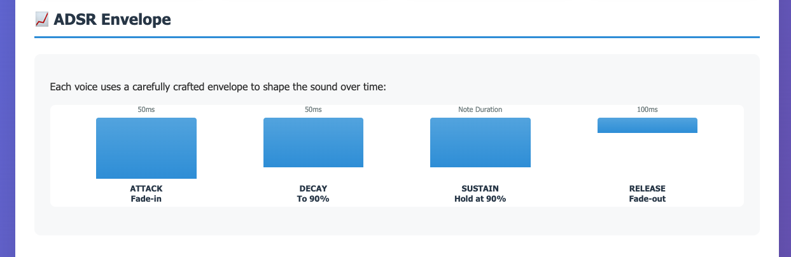

# VoxQuad 🎵

A browser-based SATB (Soprano, Alto, Tenor, Bass) voice synthesizer that lets you create four-part vocal harmonies using Web Audio synthesis.


VoxQuad simulates a vocal quartet right in your browser. Using formant synthesis technology, it creates sounds for four different voice types, allowing you to compose and play back harmonic progressions.

## Features

- **4-Voice Synthesis**: Soprano, Alto, Tenor, and Bass voices with synthetic formants
- **Interactive Matrix**: Visual grid for composing 4-measure progressions  
- **Smart Autocomplete**: Quick note and chord selection
- **Real-time Playback**: Instant audio feedback with Web Audio API
- **Individual Voice Control**: Adjust volume for each voice independently

## Quick Start

### Prerequisites
- Ruby 3.4+
- Rails 8.0+

### Installation

1. Clone the repository
```bash
git clone https://github.com/yourusername/voxquad.git
cd voxquad
```

2. Install dependencies
```bash
bundle install
```

3. Start the server
```bash
rails server
```

4. Open your browser to `http://localhost:3000`

## How to Use

### Creating a Composition

1. **Select Chords** (optional): Choose a chord for each measure to guide your harmony
2. **Choose Notes**: Click on each voice box to select notes for each measure
3. **Play**: Click the "Play Composition" button to hear your creation

### Voice Controls

- **Master Volume**: Controls overall playback volume
- **Individual Voices**: Adjust the mix of Soprano, Alto, Tenor, and Bass

### Tips

- The default progression (G-F-Fm-C) demonstrates a classic harmonic movement
- Try keeping common tones between chords for smoother voice leading
- Bass notes typically match the chord root for stability

## Technology Stack

- **Rails 8**: Modern web framework with importmap for JavaScript
- **Web Audio API**: Browser-native audio synthesis
- **Custom CSS**: Clean, purpose-built styling
- **No Database**: Pure client-side application
- **Formant Synthesis**: Acoustic modeling for vocal sounds

## Project Structure

```
app/
├── javascript/
│   ├── synth.js           # Main orchestrator
│   └── synth/
│       ├── music-theory.js # Notes, chords, frequencies
│       ├── audio-engine.js # Sound synthesis
│       └── ui-controls.js  # User interface
├── views/synth/
│   └── playground.html.erb # Main UI
└── assets/stylesheets/
    └── synth.css          # Custom styles
```

## Audio Engine Technical Details

VoxQuad's audio synthesis is built using the Web Audio API and implements several acoustic modeling techniques to create realistic vocal sounds through advanced formant synthesis.

### Audio Synthesis Chain

Each SATB voice follows this carefully designed signal processing chain:


The synthesis chain uses native browser [Web Audio API](https://developer.mozilla.org/en-US/docs/Web/API/Web_Audio_API/Using_Web_Audio_API#audio_context) components:

1. **[OscillatorNode](https://developer.mozilla.org/en-US/docs/Web/API/OscillatorNode)** - Generates sawtooth wave (simulates vocal cord vibration)
2. **[BiquadFilterNode](https://developer.mozilla.org/en-US/docs/Web/API/BiquadFilterNode) (F1)** - First formant resonance (Peaking, Q=10, +12dB gain)
3. **[BiquadFilterNode](https://developer.mozilla.org/en-US/docs/Web/API/BiquadFilterNode) (F2)** - Second formant resonance (Peaking, Q=15, +8dB gain)
4. **[BiquadFilterNode](https://developer.mozilla.org/en-US/docs/Web/API/BiquadFilterNode) (Lowpass)** - Removes harsh harmonics above 3kHz
5. **[GainNode](https://developer.mozilla.org/en-US/docs/Web/API/GainNode)** - Volume control with ADSR envelope
6. **Master Output** - Final mix to speakers

### Formant Synthesis Theory

The heart of VoxQuad's voice simulation uses [formant synthesis](https://en.wikipedia.org/wiki/Formant). Formants are resonant frequencies of the human vocal tract that give each vowel sound its characteristic timbre. Our implementation uses the classic "AH" vowel formants:

- **F1 (First Formant)**: 827 Hz - Controls vowel openness
- **F2 (Second Formant)**: 1542 Hz - Controls vowel frontness
- **Voice-specific scaling** simulates different vocal tract sizes

### ADSR Envelope Design

Each voice uses a carefully crafted [ADSR envelope](https://en.wikipedia.org/wiki/Envelope_(music)) to shape the sound naturally over time:



**Envelope Parameters:**
- **Attack**: 50ms fade-in (quick onset)
- **Decay**: 50ms to 90% of peak (slight softening)
- **Sustain**: Held at 90% for note duration (stable tone)
- **Release**: 100ms fade-out (natural decay)

This envelope creates a more musical and less mechanical sound compared to simple on/off switching.

### Voice Characteristics & Formant Scaling

Each SATB voice has distinct acoustic properties based on human vocal tract research:

| Voice | Scaling | Characteristics | Formant Properties |
|-------|---------|----------------|-------------------|
| **Soprano** | 1.2x | Smaller vocal tract | Brighter, higher formants, more resonance |
| **Alto** | 1.1x | Mid-high vocal tract | Warmer mid-range, balanced timbre |
| **Tenor** | 1.0x | Reference size | Balanced formants, natural resonance |
| **Bass** | 0.85x | Larger vocal tract | Darker, lower formants, deep resonance |

### Technical Specifications

- **Sample Rate**: Browser default (typically 44.1kHz)
- **Waveform**: Sawtooth (rich in harmonics like vocal cords)
- **Filter Types**: Peaking (formants) + Lowpass (3kHz cutoff)
- **Real-time Processing**: Zero-latency Web Audio API synthesis

> 📖 **For complete technical details**, see our [Audio Engine Architecture Documentation](docs/voxquad-audio-engine-diagram.md)

## Development

The app uses Rails' importmap for JavaScript modules - no webpack or node_modules needed!

To add new features:
1. Identify the appropriate module (music-theory, audio-engine, or ui-controls)
2. Add your code to that module
3. Import what you need using Rails importmap conventions

## Contributing

Contributions are welcome! Feel free to:
- Report bugs
- Suggest new features
- Submit pull requests

## License

MIT

---

Built with ♪ by @leandronsp. All code and assets are MIT licensed.
